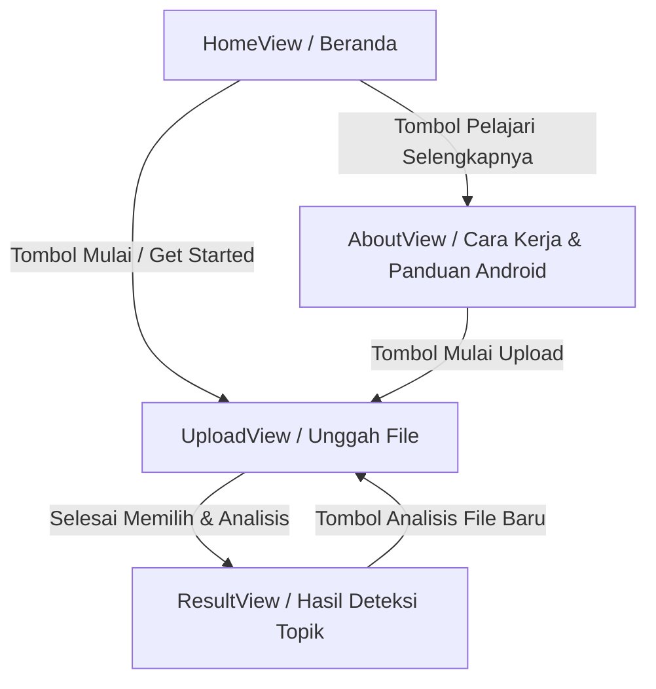

# Dokumentasi Arsitektur & Dependensi Paket
Sistem Analisis Topik Grup WhatsApp Berbasis Web (Frontend)

Dokumen ini menjelaskan dependensi paket yang terpasang serta desain arsitektur antarmuka (frontend) proyek yang dikembangkan menggunakan **Vue 3**, **TypeScript**, **Tailwind CSS v4**, **PrimeVue v4**, dan **VueUse**.

---

## 1. Daftar Paket yang Terpasang (Dependencies)

Berikut adalah ringkasan dependensi utama dan devDependencies yang dikonfigurasi dalam berkas `package.json`:

### Core & Framework
* **`vue`** (`^3.5.38`): Framework utama Vue 3 menggunakan Composition API (`<script setup>`).
* **`typescript`** (`~6.0.0`): Memberikan pengetikan statis yang kuat (*strict type checking*) di seluruh proyek.
* **`vite`** (`^8.0.16`): Build tool super cepat untuk pengembangan frontend modern.

### Routing & State Management
* **`vue-router`** (`^5.1.0`): Router resmi Vue untuk navigasi halaman (*Single Page Application*).
* **`pinia`** (`^3.0.4`): Store manajemen state global untuk mengelola data hasil analisis.

### UI & Desain Sistem
* **`primevue`** (`^4.5.5`): Pustaka komponen UI premium. Dikonfigurasi menggunakan preset kustom **Aura** dengan warna primer yang diselaraskan ke tema Amber.
* **`@primevue/themes`** (`^4.5.4`): Utilitas preset tema desain sistem PrimeVue.
* **`primeicons`** (`^7.0.0`): Ikon vektor resmi dari PrimeTek yang diintegrasikan untuk semua visualisasi antarmuka.
* **`tailwindcss`** (`^4.3.2`): Utilitas CSS utility-first versi 4.0.
* **`@tailwindcss/vite`** (`^4.0.0`): Plugin resmi untuk kompilasi native Tailwind CSS v4 di lingkungan Vite.
* **`postcss`** & **`autoprefixer`**: Mengoptimalkan dan menyematkan vendor-prefix otomatis pada CSS hasil kompilasi.

### Utilities
* **`@vueuse/core`** (`^14.3.0`): Kumpulan fungsi utilitas Vue. Dalam proyek ini digunakan untuk mempermudah deteksi interaksi drag-and-drop file pada area dropzone (`useDropZone`).

---

## 2. Struktur Arsitektur Direktori

Struktur folder dikembangkan secara modular untuk memisahkan logika tampilan (*Views*) dengan komponen antarmuka yang dapat digunakan kembali (*Reusable Components*).

```
src/
├── assets/
│   ├── main.css          # Titik masuk CSS global (Tailwind v4, PrimeIcons, & variabel warna)
│   └── base.css          # Variabel CSS bawaan (opsional)
├── components/
│   ├── DropZone.vue       # Komponen upload reusable berbasis VueUse
│   ├── ExportTutorial.vue # Komponen tutorial ekspor chat WhatsApp (Android)
│   └── TopicCard.vue      # Komponen penampil detail individu kluster topik
├── router/
│   └── index.ts          # Konfigurasi jalur navigasi rute halaman
├── stores/               # Manajemen state global (Pinia)
├── views/                # Halaman utama (Views)
│   ├── HomeView.vue      # Landing Page utama
│   ├── AboutView.vue     # Halaman penjelasan alur kerja & ekspor
│   ├── UploadView.vue    # Halaman upload file log WhatsApp
│   └── ResultView.vue    # Halaman visualisasi data topik obrolan
├── App.vue               # Tata letak global (Sticky Header, RouterView, & Footer)
└── main.ts               # Entrypoint aplikasi (Registrasi PrimeVue, Router, Pinia)
```

---

## 3. Skema Palet Warna Kustom: "Ink & Ember"

Warna terdaftar secara konsisten sebagai variabel CSS global (`:root`) dan dipetakan ke dalam `@theme` Tailwind CSS v4 untuk menghasilkan utilitas Tailwind seperti `bg-bg`, `bg-surface`, `text-ink`, `text-accent`, dan lainnya.

| Kategori | Token Warna | Kode Hex | Deskripsi | Utility Class |
| :--- | :--- | :--- | :--- | :--- |
| **Background** | `--color-bg` | `#12141C` | Latar belakang utama aplikasi | `bg-bg` |
| **Surface** | `--color-surface` | `#1B1E2A` | Panel, kartu, dan area kontainer | `bg-surface` |
| **Border** | `--color-border` | `#2C303F` | Garis pembatas dan separator | `border-border` |
| **Main Text** | `--color-text` / `--color-ink` | `#E8E6E1` | Teks utama dengan tingkat kontras tinggi | `text-ink` |
| **Muted Text** | `--color-text-muted` / `--color-muted` | `#8B8F9E` | Deskripsi pendukung dan teks keterangan | `text-muted` |
| **Primary Accent** | `--color-accent` | `#E0A75E` | Warna amber untuk tombol CTA dan sorotan | `text-accent` / `bg-accent` |
| **Secondary Accent** | `--color-accent-alt` | `#5EC9C0` | Warna teal untuk visualisasi data viz / Android | `text-accent-alt` / `bg-accent-alt` |

---

## 4. Alur Navigasi Aplikasi


